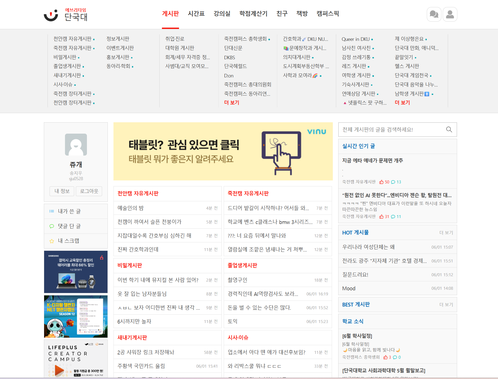

단국대학교 오픈소스SW기초 수업 과제 프로젝트입니다.

소프트웨어학과 22학번 이기윤

소프트웨어학과 24학번 송지우

모바일시스템공학과 23학번 정민서

정보통계학과 22학번 김진우

https://kyni.notion.site/1b416d2b6c8c80de8a7eccb232fe7fb2

---
# 유저 가이드 

## 단국 에브리타임! DKU_TIME
사실상 100%의 대학생이 사용하는 에브리타임. 데스크탑으로 들어갔을 때 만큼이라도 더 실용적으로 쓸 수 없을까? 

여기서 비롯된 단국 에브리타임 확장프로그램은 단국대학교 학생들의 편의를 위해 맞춤화하는 도구입니다. 기본 UI를 단국대 스타일로 변경하고, 시간표 및 학생식당 메뉴 등 주요 정보를 빠르게 확인할 수 있도록 도와줍니다. 

https://developer.chrome.com/docs/extensions/develop/migrate/publish-mv3?hl=ko 로 이동하여 크롬 브라우저에 확장프로그램을 추가합니다.

 
everytime.kr, 즉 에브리타임으로 이동하여 로그인을 하면 바뀐 테마와 편의 기능을 확인할 수 있습니다.
 

- 크롬 브라우저의 우측 상단에서 추가한 확장프로그램을 확인할 수 있습니다.

## 1. 주요 기능 

### 1.1 로고 및 테마 변경 
- 에브리타임 접속 시 기본 에브리타임 로고 대신 단국대 로고가 자동 표시됩니다. 
- 단국대 상징 색인 파란색 테마가 적용됩니다.

### 1.2 에드가드 기능(광고제거)
- 에브리타임 내 광고가 자동으로 차단됩니다. 
- 페이지 로딩 시 광고 영역이 보이지 않아 쾌적한 이용 환경을 제공합니다. 

### 1.3 시간표 표시 기능
- 별도의 탭 이동 없이 시간표를 바로 확인할 수 있습니다. 

### 1.4 학점 정보 표시 
- 에브리타임 학점 계산시 기능 사용 시, 본인의 학점 정보가 시간표 아래쪽에 함께 표시됩니다.

### 1.5 학생식당 메뉴 추천 
- 첫 페이지 중간 위치에 학생식당 추천 메뉴가 표시됩니다. 

### - 사용 전후 
- 일반 버전

- 확장프로그램 실행 버전

### 1.6 팝업 기능

- 오른쪽 상단의 확장 프로그램을 클릭하면, 원하는 기능을 끄고 켤 수 있는 팝업 창이 나옵니다. 
- `키워드 차단 설정...` 으로 들어가면 원하는 키워드를 추가하거나 추가 편의 기능을 켤 수 있습니다. 

## 2. 

---
# 개발자 가이드

### 프로젝트 디렉터리 구조
- `background/` : 백그라운드에서 돌아가는 스크립트
- `icons/` : 사용되는 icon
- `lib/` : 라이브러리를 쓸 경우 넣을 폴더
- `options/` : 확장프로그램 세부 정보에서 들어갈 수 있는 옵션 탭을 관리
- **popup/** : 팝업 창의 HTML/CSS/JS
- **scripts/** : 실제로 확장프로그램이 **everytime.kr** 에 대해 적용하는 JS/CSS

확장프로그램이 everytime.kr 에 적용하는 전체적인 내용은 content.js 를 확인하면 볼 수 있습니다.

content.js 는 JS의 module 기능을 이용할 수 없어 import 등이 불가능합니다.

### 확장 프로그램 테스트 방법

1. 크롬 브라우저 우측 상단에 확장프로그램 버튼을 눌러 `확장 프로그램 관리` 클릭합니다.

또는 주소창에 직접 chrome://extension 을 입력합니다.

2. 확장프로그램 관리 탭으로 이동하였으면, 우측 상단에 개발자 모드를 킵니다.

3. 개발자 모드를 키면 압축해제된 확장프로그램을 로드할 수 있습니다.

이 방법으로 dku-everytime-extension 프로젝트를 직접 테스트할 수 있습니다.

---
